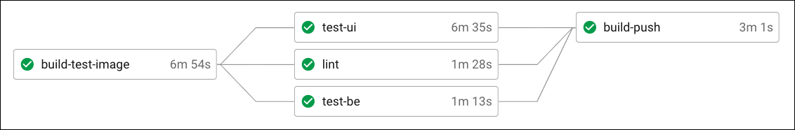

import Callout from '../../components/callout';

Have you encountered slow tests when using React Testing Library or Jest in general? Have you found your Docker images running tests for too long in CircleCI? If so I'm going to share some tips on how I reduced our test execution time from 20 minutes down to 2! 🚀

## Background

A team member frantically submitted a hotfix pull request and waited for the CI environment to kick off the tests. And waited. And waited. 20 minutes later the test failed with a lint error. After scrambling to push a fix the test suite ran again. Oops another error, this time with an actual test. Another fix hastily pushed and another 20 minutes sat waiting, nervously watching each second in the hope it doesn't fail. Finally, the green light to merge - oh but merging to the master branch re-triggers the tests before deploying 😰. An hour and a half later and at last the fix is in production, accompanied by a huge sigh of relief.

If this slow feedback loop sounds familiar, you can relate to the pain my frustrated team encountered on a daily basis. Having looked into the tests there was no easy win for reducing the total execution time, tests just couldn't simply be deleted nor the scope reduced. Here are some of the things I changed to make our tests run much faster.

## React Testing Library

When it comes to the front-end we mostly write component integration tests since they give us more confidence that our software works and helps to avoid brittle unit tests:

https://twitter.com/erinfranmc/status/1148986961207730176

[React Testing Library](https://testing-library.com/docs/react-testing-library/intro/) is a fantastic tool which allows us to write maintainable tests for React components that better simulate how our end users interact with our apps. As per their [query recommendations](https://testing-library.com/docs/queries/about#priority) we've been using the `getByRole` and `findByRole` methods pretty much exclusively, however it turns out that these two methods can be the cause of some significant slowdowns.

For our internal search application (think Amazon with checkbox filters/button toggles down the left hand side) we have tests that check the correct api query is sent to the backend based on various user interactions with different filters, something along the lines of:

```js:title=file.spec.js
import { render, screen, waitFor } from '@testing-library/react';
import userEvent from '@testing-library/user-event';
import { server } from './mock-server';
import App from '../app';

function setup() {
  const utils = render(<App />);
  const searchInput = screen.getByPlaceholderText('Type in a keyword');
  const searchButton = screen.getByRole('button', { name: 'Search' });

  return { ...utils, searchInput, searchButton };
}

describe('<App />', () => {
  it('should send the correct query to the api', async () => {
    const { searchInput, searchButton } = setup();

    userEvent.type(searchInput, 'foo');
    userEvent.click(searchButton);

    await waitFor(() => expect(server.requests[0].url).toBe('/api/search?q=foo'));

    fireEvent.click(screen.getByRole('button', { name: 'Please select a date' }));
    fireEvent.click(await screen.findByRole('button', { name: 'Sep' }));

    await waitFor(() => {
      expect(server.requests[0].url).toBe('/api/search?q=foo&date=2020-09-01'));
    };

    // repeat for each filter
  }, 60000);
});
```

<Callout>I should note that ordinarily we don't write assertions against dispatched requests like this (since this is testing implementation details) and instead we test <em>how</em> the application reacts to requests. But in this case there were over 30 search queries being tested across different filter combinations and mocking (and maintaining) fixtures for each combination was more of a burden.</Callout>

This test takes around 60 seconds to run, so one of first things to try and understand where the time is spent is to add `console.time` logs around the methods:

```js:title=file.spec.js
console.time('setup');
const { searchInput, searchButton } = setup();
console.timeEnd('setup');

console.time('keyword');
userEvent.type(searchInput, 'searchTerm');
console.timeEnd('keyword');

console.time('search');
userEvent.click(searchButton);
console.timeEnd('search');

console.time('api query 1');
await waitFor(() => {
  expect(server.requests[0].url).toBe('/api/search?q=foo'));
});
console.timeEnd('api query 1');

console.time('open date picker');
fireEvent.click(screen.getByRole('button', { name: 'Please select a date' }));
console.timeEnd('open date picker');

console.time('select date');
fireEvent.click(await screen.findByRole('button', { name: 'Sep' }));
console.timeEnd('select date');

console.time('api query 2');
await waitFor(() => {
  expect(server.requests[0].url).toBe('/api/search?q=foo&date=2020-09-01'));
});
console.timeEnd('api query 2');
```

This highlights something interesting - the `getByRole` and `findByRole` queries take seconds!

```js:title=file.spec.js
console.time
  setup: 744 ms

console.time
  keyword: 12 ms

console.time
  search: 202 ms

console.time
  api query 1: 2 ms

console.time
  open date picker: 4885 ms

console.time
  select date: 1087 ms

console.time
  api query 2: 5 ms
```

Close to 5 seconds to open a date picker is far too long! Looking around for similar issues led me to an open [GitHub issue](https://github.com/testing-library/dom-testing-library/issues/820) which relates to this and provided me with an idea. Turns out replacing the `getByRole` and `findByRole` queries with `getByText` and `findByText` makes things much faster:

```javascript:title=file.spec.js
console.time
  open date picker: 2553 ms

console.time
  select date: 84 ms
```

After more debugging into the internals of Dom Testing Library the remaining time is taken up by [JSDOM](https://github.com/jsdom/jsdom) and there isn't any more that can be done. Since the majority of `getByRole` and `findByRole` queries are against `<button>` elements we can create the following helper methods which handle our use cases well enough:

```js:title=helper.js
import { screen } from '@testing-library/react';

const ROLE_BUTTON = 'button';

export function getByButton(name, queryOptions) {
  const element = screen.getByText(name, queryOptions);

  return element.tagName.toLowerCase() === ROLE_BUTTON
    ? element
    : element.closest(ROLE_BUTTON);
}

export async function findByButton(name, queryOptions, waitForOptions) {
  const element = await screen.findByText(name, queryOptions, waitForOptions);

  return element.tagName.toLowerCase() === ROLE_BUTTON
    ? element
    : element.closest(ROLE_BUTTON);
}
```

Now I don't recommended blindly replacing all `*ByRole` methods with `*ByText`, it's important to profile your code and replace where appropriate since they are still the most accessible way to query for elements. Additionally these helper methods take a very naive approach and don't handle a lot of cases that React Testing Library deals with, so use with caution! ⚠️

## Splitting tests by function

Our application runs in a Docker container and makes use of the [multi-stage](https://docs.docker.com/develop/develop-images/multistage-build/) feature for faster builds and smaller images. Our general setup involves  CircleCI invoking a make command to build the Docker image with the target stage set to test. In our Dockerfile we run two NPM commands to test and lint the application. It looks something like this:

```yml:title=.circleci/config.yml
version: 2

jobs:
  set-env-vars:
    docker:
      - image: circleci/node:lts
  build-test:
    machine:
      image: ubuntu-2004:202010-01
    steps:
      - checkout
      - attach_workspace:
          at: /home/circleci
      - run: make test

workflows:
  version: 2
  build-test-image:
    jobs:
      - build-test
```

```makefile:title=Makefile
test:
  docker build \
    --build-arg NODE_ENV=production \
    --target test \
    -t $(APP_IMAGE_NAME):$(APP_IMG_VER)-test .
```

```dockerfile:title=Dockerfile
FROM source AS test

# other things...

RUN npm run test && npm run lint
```

```json:title=package.json
{
  "scripts": {
    "test": "jest",
    "lint": "eslint"
  }
}
```

The problem with this approach is twofold: 1) slower test execution times and 2) slow feedback loops. The sequential nature of the tests means linting can only run after the tests have successfully finished. As more tests are added the total elapsed time increases, but worse is that if an error is triggered early on then the entire execution stops and there is no way to know if there will be any more errors further down the line until fixing and re-running the test suite.

So one way to tackle this is to split these tests and run them in parallel. Firstly we can split the tests by backend and front-end by passing arguments to Jest:

```json:title=package.json
{
  "scripts": {
    // replace src/client-app with the path to your front-end code
    "test:ui": "jest src/client-app",
    "test:be": "jest --testPathIgnorePatterns src/client-app",
    "lint": "eslint"
  }
}
```

We also need to modify our Dockerfile since it runs tests and linting sequentially:

```dockerfile
RUN npm run test && npm run lint
```

Now you might think introducing separate build stages in your Dockerfile would be the easy thing to do, however the biggest downside with this approach is the inability to reuse the Docker image across all jobs. Building a separate image for each job is inefficient and wastes time since all the code needed to run testing and linting is the same, we only need to change the run command to point to one of the NPM scripts. So how do we solve this? Enter [Docker entrypoints](https://docs.docker.com/engine/reference/builder/#entrypoint). Docker entrypoints allow us to configure how the container will be run. In this case we can pass command line arguments to the same test image.

```dockerfile:title=Dockerfile
FROM source AS test

# Remove the RUN directive:
# RUN npm run test && npm run lint

ENTRYPOINT ["/node/app/bin/docker-entrypoint.tests.sh"]
```

```bash:title=bin/docker-entrypoint.tests.sh
#!/bin/sh

echo "Test entrypoint: ${1}"

set -ex
case $1 in
  lint)
    exec yarn lint
    ;;
  test-be)
    exec yarn test:be
    ;;
  test-ui)
    exec yarn test:ui
    ;;
  *)
    echo "Invalid command: ${1}"
    ;;
esac
```

We can now configure our Makefile to pass these arguments like so:

```makefile:title=Makefile
test:
  docker build \
    --build-arg NODE_ENV=production \
    --target test \
    -t $(APP_IMAGE_NAME):$(APP_IMG_VER)-test .

ci-lint: ##@CircleCI Run lint tests in a test container
  docker run --rm $(APP_IMAGE_NAME):$(APP_IMG_VER)-test lint

ci-test-be: ##@CircleCI Run backend tests in a test container
  docker run --rm $(APP_IMAGE_NAME):$(APP_IMG_VER)-test test-be

ci-test-ui: ##@CircleCI Run UI tests in a test container
  docker run --rm $(APP_IMAGE_NAME):$(APP_IMG_VER)-test test-ui
```

Lastly in our CircleCI configuration we can create separate jobs for each of these stages:

```yml:title=.circleci/config.yml
version: 2

executors:
  vm:
    machine:
      image: ubuntu-2004:202010-01

jobs:
  set-env-vars:
    docker:
      - image: circleci/node:lts
  build-test:
    executor: vm
    steps:
      - checkout
      - attach_workspace:
          at: /home/circleci
      - run: make build-test-image
      - run: make persist-test-image
      - persist_to_workspace:
          root: /home/circleci
          paths:
            - workspace
  lint:
    executor: vm
    steps:
      - attach_workspace:
          at: /home/circleci
      - run: make load-test-image
      - run: make ci-lint
  test-be:
    executor: vm
    steps:
      - attach_workspace:
          at: /home/circleci
      - run: make load-test-image
      - run: make ci-test-be
  test-ui:
    executor: vm
    steps:
      - attach_workspace:
          at: /home/circleci
      - run: make load-test-image
      - run: make ci-test-ui

workflows:
  version: 2
  build-test-image:
    jobs:
      - set-env-vars
      - lint:
          requires:
            - build-test
      - test-be:
          requires:
            - build-test
      - test-ui:
          requires:
            - build-test
```

The important thing to note here is we only build the docker container once. The `make persist-test-image` and `make load-test-image` commands allow us to configure CircleCI to reuse the image across jobs.

```makefile:title=Makefile
persist-test-image: ##@CircleCI Store a Docker image for testing jobs
  docker save $(APP_IMAGE_NAME):$(APP_IMG_VER)-test | gzip > $(APP_IMAGE_NAME)_$(APP_IMG_VER).tar.gz

load-test-image: ##@CircleCI load a Docker image for tests
  docker load < $(APP_IMAGE_NAME)_$(APP_IMG_VER).tar.gz
```

With these changes our total test execution time now only takes around 6 minutes:



## Docker layer caching

We already make use of [Docker Buildkit](https://www.docker.com/blog/advanced-dockerfiles-faster-builds-and-smaller-images-using-buildkit-and-multistage-builds/) in our Docker containers since it enables caching for fast rebuilds and smaller images. When we build production or test images locally Buildkit is able to reuse unchanged layers to speed up the build process. However in CI environments this doesn't work since every build is prepared in a fresh environment. [Docker layer caching](https://circleci.com/docs/2.0/docker-layer-caching/) is a feature of CircleCI that allows us to reuse image layers across jobs. Since we're using machine executors in our config, enabling this is a simple one liner:

```yml{5}:title=.circleci/config.yml
executors:
  vm:
    machine:
      image: ubuntu-2004:202010-01
      docker_layer_caching: true
```

With this change our Docker image build times are down to 2 minutes. 🚀


## Running UI tests in parallel

With all these changes the backend tests and linting take one or two minutes to complete but the UI tests take about 6 minutes. Now you could argue this is good enough but let's see if we can further reduce this time. It turns out CircleCI can run jobs in [parallel](https://circleci.com/docs/2.0/parallelism-faster-jobs/) by spreading them across multiple separate executors. By specifying a job's parallelism level we can split the UI tests by file to spread them out across multiple machines.

In our `test-ui` job we can add the parallelism key to enable parallel jobs. We also need to pass it a list of test files by using the `circleci tests split` command:

```yml{4,11-14}:title=.circleci/config.yml
jobs:
  test-ui:
    executor: vm
    parallelism: 8
    steps:
      - attach_workspace:
          at: /home/circleci
      - run: make load-test-image
      - run:
        name: Run UI tests
        command: |
          shopt -s globstar
          TEST_LIST=$(circleci tests glob src/client-app/**/*.spec.js | circleci tests split | tr "\n" " ")
          make TEST_LIST="\"$TEST_LIST\"" ci-test-ui
```

By adding `circleci tests glob` we can pass all test files within the `src/client-app` directory and CircleCI will evenly distribute them across 8 machines in parallel. Since we're passing the full path to each test file we need to amend our Makefile to pass along the `TEST_LIST`:

```makefile
ci-test: ##@CircleCI Run UI tests in a test container
  docker run --rm $(APP_IMAGE_NAME):$(APP_IMG_VER)-test test-ui $(TEST_LIST)
```

When executed you'll see something like the following output:

```bash
docker run --rm my-app:104e4ac-test test-ui \
  && "src/client-app/foo/__tests__/foo.spec.js src/client-app/bar/__tests__/bar.spec.js"
```

Similarly we also need to modify our Docker entrypoint file to pass these arguments to Jest:

```bash{9}:title=bin/docker-entrypoint.tests.sh
case $1 in
  lint)
    exec yarn lint
    ;;
  test-be)
    exec yarn test:be
    ;;
  test-ui)
    exec yarn test:ui $(echo $2)
    ;;
  *)
    echo "Invalid command: ${1}"
    ;;
esac
```

And lastly modify our `test:ui` script in package.json to remove the previous hardcoded client-app path since our entrypoint will pass the full path:

```json{4}:title=package.json
{
  "scripts": {
    // "test:ui": "jest src/client-app",
    "test:ui": "jest",
    "test:be": "jest --testPathIgnorePatterns src/client-app",
    "lint": "eslint"
  }
}
```

For example Jest will end up executing something similar to:

```bash
$ jest src/client-app/foo/__tests__/foo.spec.js src/client-app/bar/__tests__/bar.spec.js
```

With these final changes we've now got our tests down to almost down to 2 minutes!


## File splitting tests

We now have our UI tests running in parallel but we're still limited by the test file that takes the longest to finish. By analysing the longest running test files and seeing which specific tests take the longest we can split those into separate files to ensure they can be run in parallel too. So if we've got got the following tests:

```js:title=foo.spec.js
// 60 seconds
it('should do something', () => {

// 20 seconds
it('should do something else', () => {

// 5 seconds
it('should do yet another thing', () => {
```

We can move the first test out into its own file which will bring the total test execution time down. And with that final change we've managed to reduce our total test execution time from 20 minutes down to 2!

## Key takeaways

- Profile where slowdowns occur.
- Consider replacing `*ByRole` queries with `*ByText` when using React Testing Library.
- Split tests into jobs (backend, front-end, linting) to parallelise the workload.
- Enable Docker layer caching.
- Run tests within a job in parallel by spreading them across multiple machines.
- Split long running tests into their own files to further take advantage of parallelism.
